# Visual site tour

This page walks through the live arena, page by page, with a screenshot for
each. Use it to see what a feature does before you read the pages that
explain it in depth ([`SPECIFICATION.md`](SPECIFICATION.md),
[`methodology.md`](methodology.md), [`operations.md`](operations.md)).

## Home

The home page states the arena's one question — *which plugin should I
use?* — and links to the three ways to answer it: leaderboards, battle
voting, and the fighter bestiary. The stat strip in the middle shows the
current scale of the arena: benchmark boards, languages, and open battles.

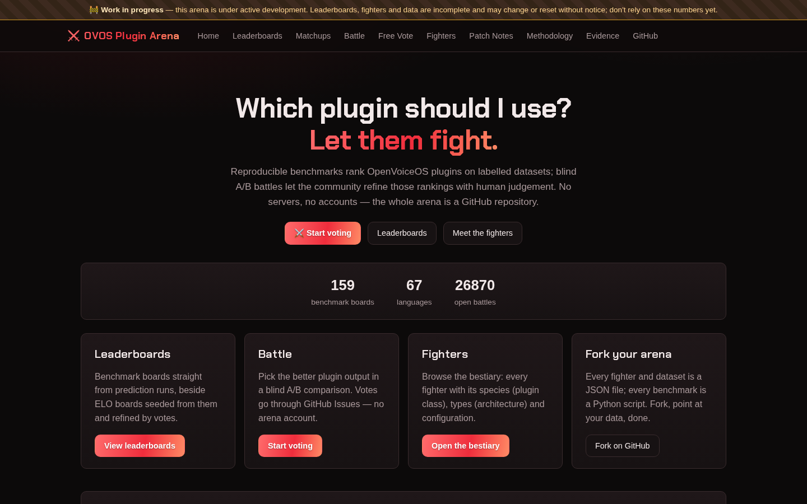

## Leaderboards

The Standings page ranks fighters two ways. The **ladder** is the rating
ranking: an ELO-style score seeded from benchmark metrics and refined by
blind-battle votes. **Benchmark boards**, further down the same page, score
every fighter straight off labelled data, with no voting involved. Pick a
league tab and a language to filter both.

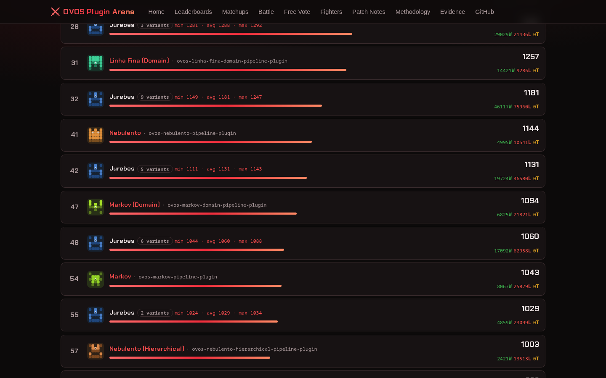

Rows with more than one trained variant collapse into one group row (a
`
` element) so the ladder does not fill up with near-duplicate
entries. Click a group to expand it and see every variant's individual
rating.

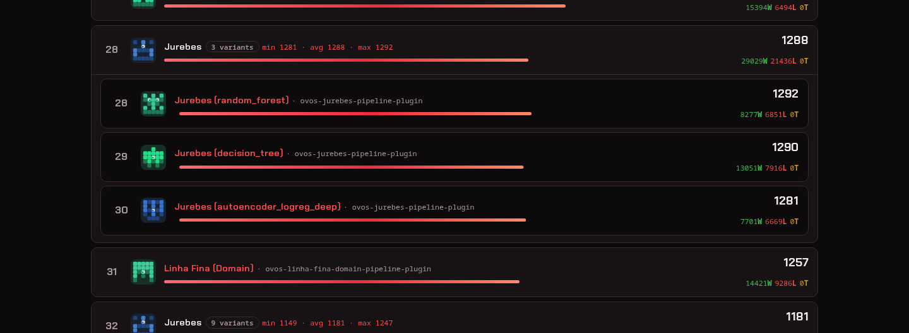

Not every league has votes yet. A league-language combination with zero
human votes and zero seeded auto-battles shows an **unranked** board
instead of a ladder — every fighter listed with no rank number, because
sorting them would imply an ordering the data does not support yet.

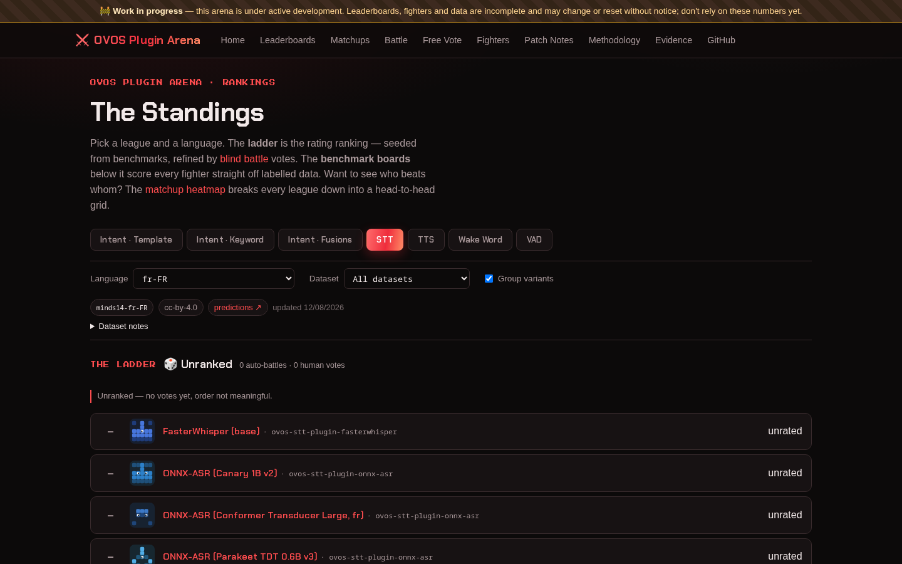

Below the ladder, the benchmark boards score fighters directly off a
labelled dataset — no votes needed. This one is the TTS
`intents-for-eval-prompts` board, ranked by UTMOS (a predicted mean
opinion score for audio naturalness), alongside latency and intelligibility
WER as secondary columns.

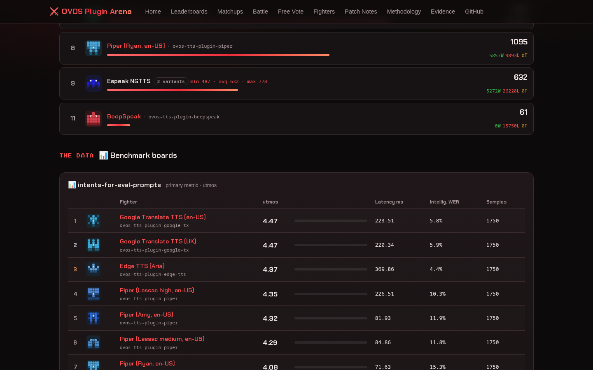

## Battle

The Battle page is the blind A/B vote flow. Two masked fighters answer the
same input — here, a transcription task — and you pick the more accurate
one. Voting opens a prefilled GitHub issue; there is no arena account and
no server, just the public issue log.

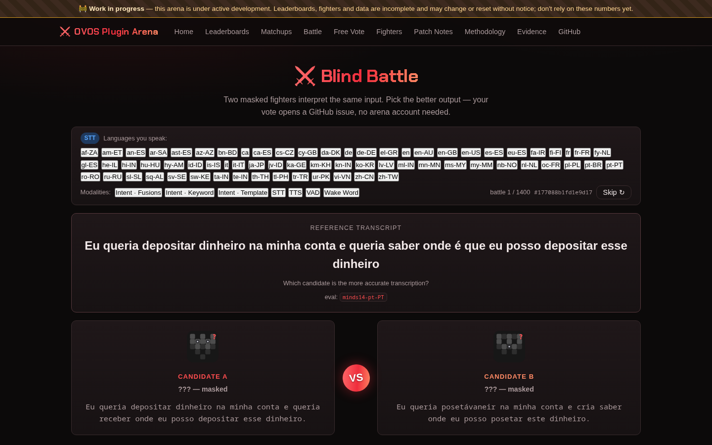

## Matchups

The Matchups page turns every league into a head-to-head grid: one row and
one column per fighter, one cell per pairing. In **Benchmark** mode (shown
here) each cell compares two fighters' own scores on the same dataset —
green means the row fighter scores higher, red means lower, and the
diagonal is masked out since a fighter is never matched against itself.
**Votes** mode shows the same grid built from real decided battles instead.

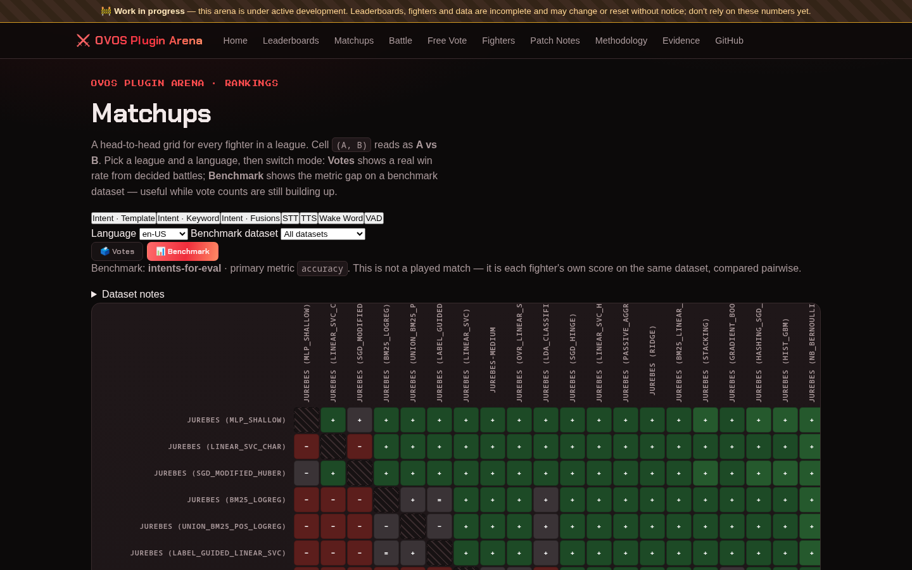

## Fighters (the bestiary)

The Fighters page lists every registered competitor with at least one
prediction row as a card: its species (the plugin class it instantiates),
its architecture types, and the `mycroft.conf` pipeline it ships. Fighters
that share a species and differ only by hyperparameter collapse into one
group card with a variant count, the same grouping the ladder uses.

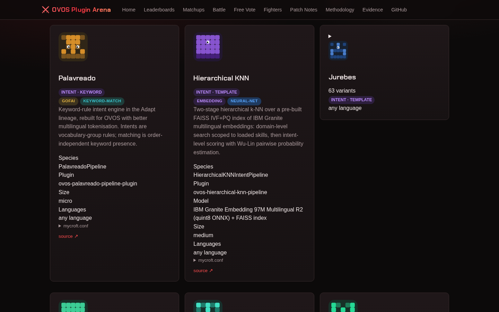

Expand a group card to see its members rendered as full fighter cards
underneath, each with its own species, model, and pipeline detail.

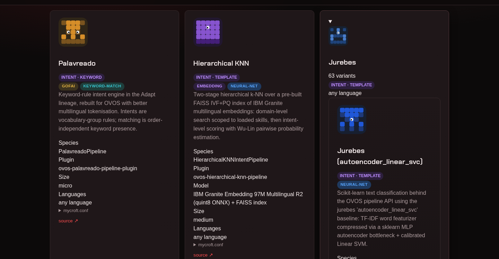

A fighter that is registered but has no predictions anywhere — no
benchmark board, no battle, no leaderboard entry — does not appear on the
main grid or in any battle/matchup picker. It sits in a collapsed
**Upcoming fighters** section below the grid instead, so a league with
many registered-but-untested fighters (some leagues carry far more
registrations than published results) does not clutter the active roster.

## Fighter detail

Each fighter has its own page: identity, rank and rating, the exact
`mycroft.conf` fragment it ships (copyable), and — where the fighter has
run against a labelled dataset — a **dataset provenance** card. The card
names the dataset, its language, its license, and links straight to the
published predictions on Hugging Face, so a rating traces back to the data
that produced it. A fighter with no predictions yet shows an **awaiting
predictions** notice instead of empty rank/provenance sections.

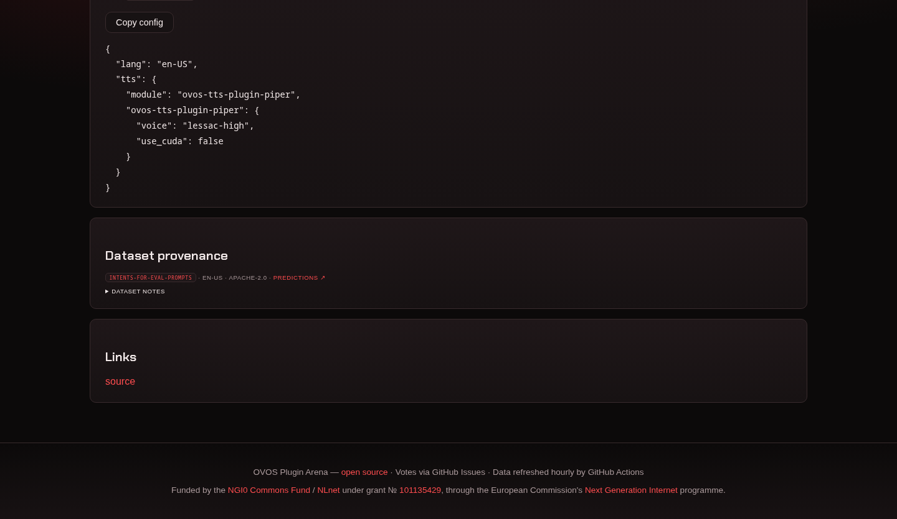

## Evidence

The Evidence page is a self-check the site runs on its own data: how many
fighters are registered per league, how many of their datasets have
published predictions, and how many benchmark boards and ELO leaderboards
actually exist as a result. Where a league has fighters but no published
predictions, that shows up here as a gap, not a rounded-up number.

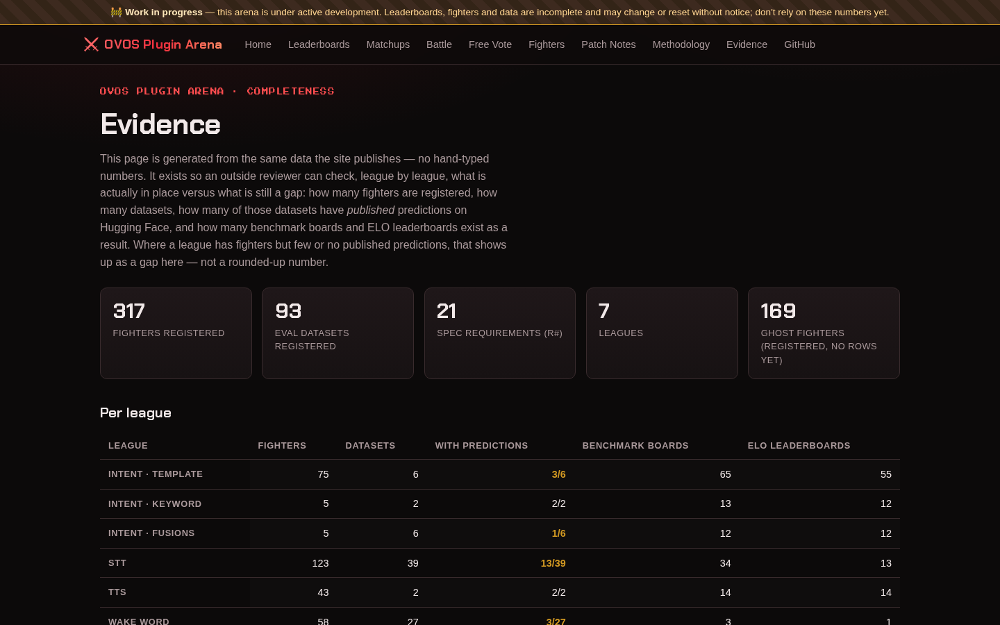

Further down, the same page rolls coverage up to the fighter level: a
league can have a published benchmark board and still carry registered
fighters with zero rows on it. The rollup counts those **ghost fighters**
per league so a reviewer can see exactly where a sweep is still in
progress.

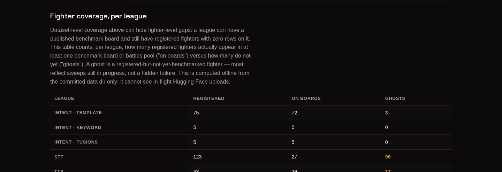

## Small screens

The site is responsive down to phone width. Filter chips wrap, and the
nav condenses, but every control on the Standings page stays reachable —
league tabs, language and dataset selectors, and the group-variants toggle.

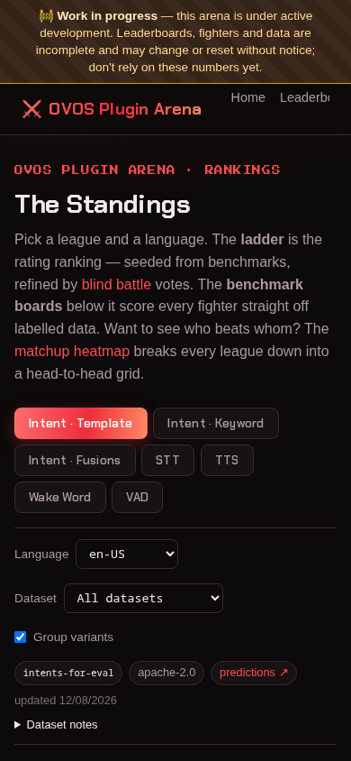

---
[← Dataset gapfill](dataset-gapfill.md) · [Home](index.md) · [Ensemble rationale →](ensemble-rationale.md)
